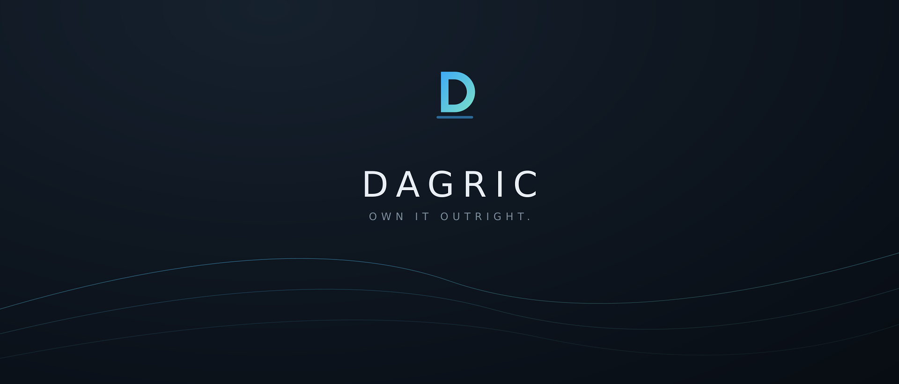

# Dagric OS



[](https://github.com/Dagric/dagric-os/releases/latest)
[](LICENSE)
[](https://dagric.com)

**A Debian-based desktop operating system built to be the antithesis of
Windows: no telemetry, no ads, no forced accounts, no bloat — a computer
that works for its owner and no one else.**

Base: Debian 13 "Trixie" (stable) · Desktop: KDE Plasma · Installer: Calamares
· Codename: **Foundation**

```
Debian Stable ──► hand-picked packages ──► debloat + hardening hooks
      ──► Dagric branding ──► bootable installer ISO
```

This repository *is* the operating system: every package choice, config file,
and policy lives here, and the ISO is rebuilt from it with one command.

**[Current release status](https://dagric.com/download)** ·
**[Verify the release](https://dagric.com/testing)** ·
**[Read the first-week guide](https://dagric.com/guide)** ·
**[Ask the community](https://github.com/Dagric/dagric-os/discussions)**

## The main attraction: Dagric Rewind

This is the next-release flagship now in the source tree and installed-VM
testing; it is not part of the published 1.0 image below.

**Your computer has an Undo button.** Dagric Rewind creates a local system
checkpoint before an install, driver, setting, or experiment; pairs it with an
after checkpoint; and explains what changed on a chronological timeline.
Existing APT and Discover package snapshots become automatic receipts. It
does not record the screen, read document contents, use the cloud, or require an
account. Recovery uses Dagric's existing Btrfs/Snapper boot path instead of a
risky live root rewrite. See the implemented design, safety boundary, evidence,
and test plan in [docs/DAGRIC-REWIND.md](docs/DAGRIC-REWIND.md).

## Two editions, one source tree

- **Dagric OS** (free) — the full debloated OS. Never crippled.
- **Dagric OS Pro** (paid) — same OS plus the preconfigured creator +
  developer suite: Chromium, Thunderbird, full LibreOffice, GIMP/PhotoGIMP,
  Krita, Inkscape, Blender, OBS, Kdenlive, Borg/Vorta/rclone backup,
  KDE Connect mobile integration, Docker/Podman, and owner-consent helpers
  for NVIDIA drivers, DaVinci Resolve, and local AI. See [docs/EDITIONS.md](docs/EDITIONS.md).

## Current verified release

**Distribution hold (4 September 2026): new binary delivery and sales are
paused.** The recorded 1.0 images remain historical artifacts. Their exact
Free/Pro binary-to-source map and five technical locale gates are now complete,
but the new candidate still lacks qualified-human rights review, candidate-bound
physical qualification, clean release provenance, signatures and promotion.
Do not present the old Free object or Pro checkout as available. See
[the release-hold record](docs/RELEASE-HOLD-2026-09-04.md).

Dagric OS 1.0 “Foundation” was recorded on 29 August 2026. Before relying on it, check the
[machine-readable release record](https://dagric.com/manifest/release.json),
[signed SHA-256 hashes](https://dagric.com/SHA256SUMS), and public
[build and test record](https://dagric.com/testing). The test record separates
virtual-machine results from the physical-hardware checks that are still open.

## Build it

On this Windows machine (Docker Desktop must be running):

```powershell
.\build.ps1                # free edition
.\build.ps1 -Edition pro   # Pro edition
```

On any Debian box: `sudo apt install live-build && sudo ./build.sh`

Full details, testing checklist, and troubleshooting: [docs/BUILDING.md](docs/BUILDING.md)

## Help put Dagric on real hardware

The most valuable contribution is independent evidence. While distribution is
held, build a candidate from this repository, verify its hash, and submit a structured
[hardware report](https://github.com/Dagric/dagric-os/issues/new/choose). You can
also improve documentation, translations, accessibility, and negative-path
tests. Start with [CONTRIBUTING.md](CONTRIBUTING.md), ask questions in
[Discussions](https://github.com/Dagric/dagric-os/discussions), and report
security problems privately through [SECURITY.md](SECURITY.md).

## What makes it the antithesis

| | Windows | Dagric |
|---|---|---|
| Telemetry | On by default | **Not shipped** |
| Ads in the OS | Start menu, lock screen | **None** |
| Account required | Yes | **No** |
| Preinstalled junk | OEM + Microsoft bloat | **Every package hand-picked** |
| Updates | Forced reboots | **Silent, background, reboot when *you* choose** |
| Risky system changes | Hope, restore tools, or a separate sandbox | **Rewind session, change receipt, explicit recovery path** |
| Source code | Closed | **Debian's archives, plus every Dagric script shipped in source form on the machine** |

The full reasoning: [docs/PHILOSOPHY.md](docs/PHILOSOPHY.md) ·
What's next: [docs/ROADMAP.md](docs/ROADMAP.md)

## How the debloat actually works

1. **`--apt-recommends false`** (`auto/config`) — APT installs nothing that
   wasn't explicitly requested, at build time *and* forever after on installed
   systems (`config/includes.chroot/etc/apt/apt.conf.d/01dagric-norecommends`).
2. **No metapackages** — `task-kde-desktop` would drag in games, PIM suites,
   and Akonadi databases. Instead, `config/package-lists/` names every package
   individually with a comment saying why it's there.
3. **Debloat hook** — `config/hooks/normal/0200-debloat.hook.chroot` purges
   anything undesirable that slipped in, then autoremoves and cleans.
4. **Flatpak for everything else** — the base OS stays minimal; users add
   apps *they* choose through Discover.

## Repository layout

```
auto/                     live-build configuration (distro, arch, ISO settings)
config/
  package-lists/          what's in the OS — one package per line, all justified
  includes.chroot/        files copied verbatim into the OS filesystem
  hooks/normal/           build-time scripts: identity, debloat, hardening
docker/                   containerized Debian build environment for Windows
branding/                 wallpaper, boot splash, and logo sources (SVG)
docs/                     PHILOSOPHY, BUILDING, ROADMAP
test/                     QEMU boot-test harness (boot-test.ps1, vm-screenshot.ps1)
.github/workflows/        CI: builds the ISO on every push once on GitHub
packages/                 dagric-* config .debs (update channel for sold machines)
build.ps1 / build.sh      one-command ISO builds (Windows / Debian)
release.ps1               versioned ISO + SHA256SUMS for distribution
repo.ps1                  build config packages + signed APT repo (docs/REPOSITORY.md)
out/                      finished ISOs land here
```

## Legal footing

Debian's software is free to modify and redistribute; this project follows
[Debian's derivative guidelines](https://wiki.debian.org/Derivatives/Guidelines):
its own name and branding, `ID_LIKE=debian` honesty in `os-release`, and no use
of Debian's restricted marks. The public source in this repository covers
Dagric's own build configuration and modifications. The frozen 1.0 source index
now maps every recorded Free and Pro binary package to exact corresponding
source, including archived `.dsc` and source-file hashes. New delivery remains
held for the independent release gates listed above; see
[the source disclosure](https://dagric.com/licenses#corresponding-source).

Dagric-authored code is licensed under GPL-3.0-or-later, while identified
branding artwork is CC-BY-SA-4.0 for copyright purposes. Trademark permission is
separate. See [LICENSE](LICENSE), [LICENSE-POLICY.md](LICENSE-POLICY.md), [LICENSES.md](LICENSES.md),
[TRADEMARKS.md](TRADEMARKS.md), and
[THIRD-PARTY-NOTICES.md](THIRD-PARTY-NOTICES.md).

Before preparing a public release, run `python tools/check-release-rights.py`
and complete the Firefox decision in
[docs/MOZILLA-DISTRIBUTION-REVIEW.md](docs/MOZILLA-DISTRIBUTION-REVIEW.md).
